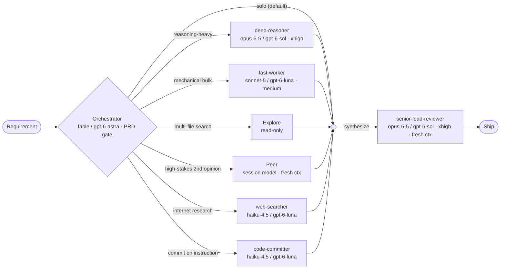

# ai-harness

AI coding-agent harness: one orchestrator routing work to pinned agents behind a
PRD gate, plus code-style skills loaded per stack and a frontier-discipline skill
for cheaper models. Built for Claude Code; the portable rules also work with any
tool that reads [AGENTS.md](AGENTS.md) (Codex, Cursor, Gemini CLI, Zed, …).

**One source of truth:** [AGENTS.md](AGENTS.md) holds everything — orchestration
workflow, delegate rules, PRD gate, code style, practices. `CLAUDE.md` is a symlink
to it, so Claude Code and every AGENTS.md-reading tool follow the same file with
nothing maintained twice. Tools with subagents map the roles to [agents/](agents/);
tools without apply each role's discipline inline.

Open `PLAYBOOK.html` for the interactive version (flow diagram with clickable nodes).

## Install

Copy/paste into your CLI prompt on the new machine:

```text
Set this machine up from https://github.com/wonpanu/ai-harness, refer to the repo's INSTALL.md for instructions.
```

Or 🔗 [check the installation instructions](INSTALL.md). It asks which providers to connect (Claude, OpenAI, or both), runs `bootstrap.sh`, then walks the logins through Orca. Model tiers are fixed by the repo.

## Flow



Rules of the road: default is **solo** (one-turn work is never delegated); every
requirement gets a brief **PRD** (goal + acceptance criteria + context) passed to
every worker and reviewer; ambiguous domain terms get resolved against project
docs (`grill-with-docs`) **before** the PRD is drafted.

## Agents

| Agent | Claude · effort | OpenAI (Codex) | Role |
|---|---|---|---|
| **Orchestrator** | session model (fable · high) | gpt-6-astra · high | The main loop. Plans, decomposes, synthesizes; writes the PRD (goal + acceptance criteria + context) before any delegation. Does one-turn work itself — delegates only when a condition below clearly applies. |
| **deep-reasoner** | opus-5-5 · xhigh | gpt-6-sol · xhigh | Reasoning-heavy phases: architecture, complex debugging, algorithm design, trade-off analysis. Returns a concise conclusion — decision, key evidence, rejected alternatives. |
| **fast-worker** | sonnet-5 · medium | gpt-6-luna · medium | Mechanical, well-specified bulk work: multi-file renames, boilerplate, test scaffolds. Executes the spec exactly, no scope expansion; verifies with a cheap check. |
| **Explore** (built-in) | inherits session | — (Claude Code only) | Read-only search across many files/directories when reading exceeds answering. Locates code, returns conclusions — never reviews or edits. |
| **Peer** | session model · fresh context | gpt-6-astra · fresh context | An engineer on par with deep-reasoner, from a different perspective — a peer, not a reviewer. Works the same high-stakes problem independently; the orchestrator synthesizes without showing either the other's answer. |
| **web-searcher** | haiku-4.5 | gpt-6-luna · low | Internet research: docs, library versions, error messages, current facts. Prefers primary sources, cross-checks surprises, returns answer + source URLs; says so when sources conflict — never guesses. |
| **code-committer** | haiku-4.5 | gpt-6-luna · low | Commits finished work on instruction from the orchestrator or another worker. Reads the actual diff before writing the message, stages only relevant files, matches repo convention. Never edits code; pushes only when explicitly told. |
| **senior-lead-reviewer** | opus-5-5 · xhigh · fresh context | gpt-6-sol · xhigh | Reviews work about to merge/ship (plans, diffs, designs) through a maintainability / tech-debt / operability lens — distinct from peer (correctness) and ponytail (over-engineering). Receives the PRD so review targets the real acceptance criteria. |

## License

MIT — see [LICENSE](LICENSE).
