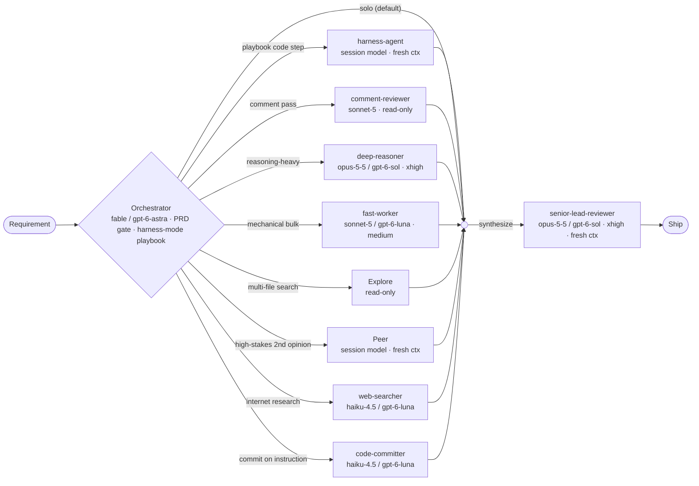

# ai-harness

AI coding-agent harness: one orchestrator routing work to pinned agents behind a
PRD gate, a task-routing mode (`harness-mode`) that matches every non-trivial task
to a playbook and copies its steps into the todo list, 24 one-rule engineering
principles the mode cites, workflow skills the playbooks call (how, why, architect,
interrogate, reflect, correct, ...), plus code-style skills loaded per stack and a
simplifying pass that keeps changed code readable. Built for Claude Code; the
portable rules also work with any tool that reads [AGENTS.md](AGENTS.md) (Codex,
Cursor, Gemini CLI, Zed, …). The routing, playbooks and principles are adapted
from [pstack](https://github.com/cursor/plugins/tree/main/pstack) (MIT); see
[docs/pstack-port.md](docs/pstack-port.md) for the mapping and
[docs/guide/](docs/guide/README.md) for a walkthrough.

**One source of truth:** [AGENTS.md](AGENTS.md) holds everything — orchestration
workflow, delegate rules, PRD gate, code style, practices. `CLAUDE.md` is a symlink
to it, so Claude Code and every AGENTS.md-reading tool follow the same file with
nothing maintained twice. Tools with subagents map the roles to [agents/](agents/);
tools without apply each role's discipline inline.

Open `PLAYBOOK.html` for the interactive version (flow diagram with clickable nodes).

## Install

Copy/paste into your CLI prompt on the new machine:

```text
Set this machine up from https://github.com/wonpanu/ai-harness, refer to the repo's INSTALL.md for instructions.
```

Or 🔗 [check the installation instructions](INSTALL.md). It asks which providers to connect (Claude, OpenAI, or both), runs `bootstrap.sh`, then walks the logins through Orca. Model tiers are fixed by the repo.

## Flow


```mermaid
flowchart LR
    REQ([Requirement]) --> ORCH
    ORCH{"Orchestrator<br/>fable / gpt-6-astra · PRD gate · harness-mode playbook"}
    ORCH -->|"solo (default)"| SYN(( ))
    ORCH -->|reasoning-heavy| DEEP["deep-reasoner<br/>opus-5-5 / gpt-6-sol · xhigh"]
    ORCH -->|mechanical bulk| FAST["fast-worker<br/>sonnet-5 / gpt-6-luna · medium"]
    ORCH -->|multi-file search| EXP["Explore<br/>read-only"]
    ORCH -->|high-stakes 2nd opinion| PEER["Peer<br/>session model · fresh ctx"]
    ORCH -->|internet research| WEB["web-searcher<br/>haiku-4.5 / gpt-6-luna"]
    ORCH -->|commit on instruction| COMMIT["code-committer<br/>haiku-4.5 / gpt-6-luna"]
    ORCH -->|playbook code step| HA["harness-agent<br/>session model · fresh ctx"]
    ORCH -->|comment pass| CR["comment-reviewer<br/>sonnet-5 · read-only"]
    HA --> SYN
    CR --> SYN
    DEEP --> SYN
    FAST --> SYN
    EXP --> SYN
    PEER --> SYN
    WEB --> SYN
    COMMIT --> SYN
    SYN -->|synthesize| REV["senior-lead-reviewer<br/>opus-5-5 / gpt-6-sol · xhigh · fresh ctx"]
    REV --> SHIP([Ship])
```

Rules of the road: default is **solo** (one-turn work is never delegated); every
requirement gets a brief **PRD** (goal + acceptance criteria + context) passed to
every worker and reviewer; ambiguous domain terms get resolved against project
docs (`grill-with-docs`) **before** the PRD is drafted.

## Task routing: harness-mode

Always on (AGENTS.md "Task routing"). At the start of a non-trivial task the
orchestrator reads [skills/harness-mode/SKILL.md](skills/harness-mode/SKILL.md),
matches the task to one of 23 [playbooks](skills/harness-mode/playbooks/)
(investigation, bug fix, feature, refactoring, perf, hillclimb, prototype,
babysit, shipping, autonomous run, orchestrate, session pickup, ...), and copies
the playbook's steps verbatim into the todo list. Steps route to the workflow
skills as they fire:

| Skill | Use it when |
|---|---|
| `how` / `why` / `teach` | you want a walkthrough of how a subsystem works, why it was built that way, or a plain explanation built up diagram by diagram |
| `architect` / `arena` / `swarm` | settle a design before code crosses a boundary; N parallel attempts then graft the best; N parallel workers across slices, one report |
| `interrogate` / `blast-radius` / `benchmark-checklist` | multi-model adversarial review of a diff; what else a small change could break; vet a measured number before reporting it |
| `reflect` / `correct` / `automate-me` | capture a session's lessons as a skill edit; change the repo so a repeated mistake class cannot recur; draft your own `-mode` skill from your history |
| `no-comments` / `unslop` / `technical-writing` / `show-me-your-work` | strip comments before review (via the `comment-reviewer` agent); remove AI tells from prose; doc standard for PRs and readmes; a reviewable decision log |

`tdd` is mandatory for every behavior change: red (failing test at an agreed seam) →
green (minimal code) → refactor (at review via `simplifying-code`), one slice at a
time; `codebase-design` gives the seam / module / interface vocabulary. Both are
adapted from [mattpocock/skills](https://github.com/mattpocock/skills) (MIT).

`harness-help` explains which playbook or skill fits. The 24 `principle-*`
skills (laziness protocol, model the domain, prove it works, never block on the
human, ...) are one rule each; the mode indexes them and the reply names the ones
that changed a decision.

## Agents

| Agent | Claude · effort | OpenAI (Codex) | Role |
|---|---|---|---|
| **Orchestrator** | session model (fable · high) | gpt-6-astra · high | The main loop. Plans, decomposes, synthesizes; writes the PRD (goal + acceptance criteria + context) before any delegation. Does one-turn work itself — delegates only when a condition below clearly applies. |
| **deep-reasoner** | opus-5-5 · xhigh | gpt-6-sol · xhigh | Reasoning-heavy phases: architecture, complex debugging, algorithm design, trade-off analysis. Returns a concise conclusion — decision, key evidence, rejected alternatives. |
| **fast-worker** | sonnet-5 · medium | gpt-6-luna · medium | Mechanical, well-specified bulk work: multi-file renames, boilerplate, test scaffolds. Executes the spec exactly, no scope expansion; verifies with a cheap check. |
| **Explore** (built-in) | inherits session | — (Claude Code only) | Read-only search across many files/directories when reading exceeds answering. Locates code, returns conclusions — never reviews or edits. |
| **Peer** | session model · fresh context | gpt-6-astra · fresh context | An engineer on par with deep-reasoner, from a different perspective — a peer, not a reviewer. Works the same high-stakes problem independently; the orchestrator synthesizes without showing either the other's answer. |
| **web-searcher** | haiku-4.5 | gpt-6-luna · low | Internet research: docs, library versions, error messages, current facts. Prefers primary sources, cross-checks surprises, returns answer + source URLs; says so when sources conflict — never guesses. |
| **code-committer** | haiku-4.5 | gpt-6-luna · low | Commits finished work on instruction from the orchestrator or another worker. Reads the actual diff before writing the message, stages only relevant files, matches repo convention. Never edits code; never pushes to main — branch + PR when told to ship. |
| **senior-lead-reviewer** | opus-5-5 · xhigh · fresh context | gpt-6-sol · xhigh | Reviews work about to merge/ship (plans, diffs, designs) through a maintainability / tech-debt / operability lens — distinct from peer (correctness) and the simplifying-code pass (over-engineering). Receives the PRD so review targets the real acceptance criteria. |
| **harness-agent** | session model · fresh context | gpt-6-astra · high | Code-writing delegate inside a harness-mode playbook step. Reads `skills/harness-mode/SKILL.md` in full (incl. the principles index) before any work; a `general-purpose` agent skips that read and drifts. |
| **comment-reviewer** | sonnet-5 · medium · read-only | gpt-6-luna · medium | Spawned by the `no-comments` skill before review. Flags every comment that fails the AGENTS.md comment rule and marks code that needs prose to be understood as `NEEDS RESHAPE`. Never edits code. |
| **Cross-model opinion** | — | `codex exec -c model="gpt-6-sol"` | One Codex run with the same prompt, used as the third seat on `arena` / `architect` / `interrogate` panels. Agreement across model families is high-signal. |

## License

MIT — see [LICENSE](LICENSE).
